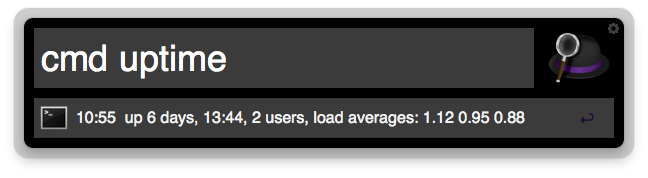
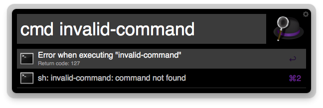

bash-alfred-workflow
====================

Alfred Workflow to run a bash command and see the output on the Alfred window

### Screenshots

### Install

Download [BashCommand.alfredworkflow](https://github.com/JaviSoto/bash-alfred-workflow/raw/master/BashCommand.alfredworkflow)

### Usage

Simply type `cmd` and the bash command you want to run (see screenshots)

### Thanks to...
I use the php script created by [@lrrfantasy](https://github.com/lrrfantasy) available here: https://github.com/lrrfantasy/alfred-feedback-xml-generation to create the output for Alfred to parse and display the results.